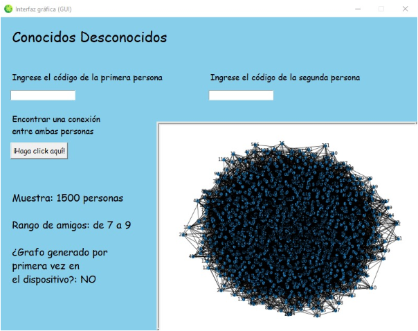

**Universidad Peruana de Ciencias Aplicadas**

**INFORME DEL TRABAJO PARCIAL (TP)**

CURSO DE COMPLEJIDAD ALGORÍTMICA - CC184

**Facultad de Ingeniería**

Carrera de Ciencias de la Computación

**SECCIÓN:**

WX73

**DOCENTE:**

Luis Martin Canaval Sanchez

**Grupo:**

3

**INTEGRANTES:**

Eduardo Jose Rivas Siesquen - u202216407

Rodrigo Alonso Ramírez Cesti - u202210690

Tarik Gustavo Morales Oliveros - u202210472

**09/2023**

**ÍNDICE**

1. Descripción del problema
2. Descripción del conjunto de datos (dataset)
3. Propuesta
4. Diseño del aplicativo

Bibliografía

1. **Descripción del problema:**

En el mundo actual, hemos podido desarrollar diferentes medios por los cuales podemos lograr conexiones y relaciones entre todos nosotros, ya sea de forma presencial mediante el cara a cara, o por medio del uso de plataformas como redes sociales. En estas últimas, hemos creado la posibilidad de formar lazos entre dos usuarios, los cuales pueden ser direccionales (como seguir a una persona) o bidireccionales (cuando dos usuarios son amigos). En este último es en el que nos vamos a centrar, donde dos usuarios son amigos, y cada uno de estos tiene sus diferentes contactos independientemente.

Entre tantas personas que llegamos a conocer a diario o que hemos conocido previamente, siempre habrá el problema de no poder conocer directamente a cierta persona en específico, lo cual puede ser un grave problema si se necesita saber algo de este individuo, como un dato, información, etc. Por ejemplo, cuando buscas una oportunidad de trabajo pero no cuentas con alguien que directamente te la pueda ofrecer, pero, entre todos los contactos y amigos que tienes, puedes ir buscando personas entre estos, hasta poder dar con el objetivo al que apuntas llegar. De esta manera, podemos conectar dos personas por medio de una relación que no sea directa, pero que por medio de un camino formado por los diferentes contactos que pueden tener entre sí se puedan conectar de forma indirecta. Esta propuesta está basada en la idea de los seis grados de separación. Esta teoría sostiene que cualquier individuo en el planeta puede establecer una conexión con otro a través de una secuencia de conocidos que no exceda los 5 intermediarios. Esto implica que pueden conectarse de un contacto a otro, hasta llegar a 6 conexiones que unen a esta pareja de usuarios (Gonzales, 2015). 

Por lo que, a partir de este análisis, vamos a tratar la situación y necesidad de conocer y determinar un camino que relacione a dos personas desconocidas entre sí a través de sus contactos, usando el menor número de intermediarios y conexiones posibles.

2. **Descripción del conjunto de datos (dataset):**
   

Se usará como fundación la base de datos “Facebook Data” (Batra, 2018). Los nodos de la nueva base de datos tendrán las siguientes características (pseudocódigo):

|Clase VÉRTICE|
| :-: |
|entero user\_id                   //un identificador para otros usuarios|
|entero friend\_count          //cantidad de aristas que conectan con otros usuarios|
|array <entero> amigos    //un arreglo de los user\_id de otros usuarios|
|bool es\_ lista\_priv          //un booleano que determina si su lista de amigos es privada|

Las aristas del grafo no serán dirigidas, ya que asumimos que al ser dos usuarios ”amigos” implica que se aceptaron la solicitud de amistad recíprocamente. Asimismo, las aristas no tendrán peso alguno, ya que el “valor” de la amistad en una red social es la misma para todos los usuarios.

El número de nodos con el que se trabajará será de 1500.

Subgrafos de ejemplo:

(Las versiones anteriores del subgrafo se guardarán en la carpeta llamada “Versiones del Grafo” en el repositorio)

3. **Propuesta:**
   

Para ofrecer un programa en el exista la posibilidad de llegar de una persona a otra solo con solo conocer los contactos de estos como una relación amigo de mi amigo, desarrollaremos un algoritmo que, basándose en la teoría de los "seis grados de separación", pueda encontrar el camino más corto y eficiente entre dos personas sin una conexión directa. Para ello utilizaremos técnicas de búsqueda y recorrido de grafos, más precisamente búsqueda iterativa en profundidad (IDS). Además, a nivel de investigación y trabajo, primero identificamos nuestros datos con un conjunto de datos (es decir, un conjunto de datos) para considerarlos en nuestros algoritmos. De esta manera, con este algoritmo, podremos comenzar desde el nodo A hasta el nodo B y encontrar una ruta a ese nodo utilizando sus conexiones con otros nodos. Para nuestra propuesta seguimos esta serie de objetivos:

- **Definición a detalle sobre el Problema:**

Detallar casos específicos del problema donde este programa sería de gran utilidad, proporcionando ejemplos concretos de situaciones comunes y demostrando que la teoría se cumple.

- **Implementación Técnica:**

Implementar el algoritmo de búsqueda y recorrido de grafos y detallar las tecnologías específicas que se utilizarán en la implementación, sin olvidar que aplicamos la teoría de los "seis grados de separación" con la búsqueda en profundidad iterativa (IDS).

- **Metodología Clara:**

Explicar detalladamente cómo se está aplicando la teoría de grafos y los "seis grados de separación" en el algoritmo, ya sea mediante ejemplos específicos de la implementación de la búsqueda en profundidad iterativa (IDS). Por ejemplo, que intentamos demostrar que cualquier persona puede estar relacionada con otra persona por un máximo de 6 vínculos.

- **Una Interfaz Clara e Intuitiva:**

Diseñar e implementar una interfaz de usuario clara e intuitiva para facilitar a los usuarios el uso del programa, que sea más fácil de entender con instrucciones claras y precisas, de modo que los usuarios puedan interactuar de manera eficiente con el algoritmo sin necesidad de habilidades técnicas avanzadas. La retroalimentación de los usuarios sobre la interfaz se incorporará para realizar mejoras continuas, punto que se abarca más a detalle en otro próximo objetivo.

- **Trabajo en equipo y Comunicación Continua:**

Si bien en el trabajo se utilizará información y documentos del proyecto, para una comunicación más directa se utilizará el chat de texto, especialmente WhatsApp, Google Drive y sus herramientas para la redacción de textos y presentaciones, así como la plataforma GitHub. Buscamos trabajar en proyectos que están más relacionados con la codificación, además del almacenamiento de archivos y el progreso en esta plataforma para que todos seamos accesibles y podamos actualizar los datos de forma segura y periódica a través de comandos de Git, etc.

- **Retroalimentación, Mejoras Continuas y Optimización:**

Se tomará en cuenta la retroalimentación a lo largo del desarrollo y se integrarán mejoras continuas en el programa, como el tema de la interfaz que se mencionó anteriormente. También es importante simplificar el lenguaje técnico para hacer la propuesta más accesible a una audiencia no especializada, es decir evaluar la complejidad algorítmica de nuestro código para optimizar el rendimiento de nuestro algoritmo. 

4. **Diseño del aplicativo:**
   

·        **Planificación:**

Durante esta fase, nos centraremos en encontrar los algoritmos apropiados para nuestro caso, conseguir datasets de muestra que nos servirán para probar las diferentes funcionalidades del programa, y diseñar una interfaz de usuario amigable y comprensible.

Comprendimos que podríamos usar diferentes algoritmos para recorrer el grafo presentado de un vértice a otro. Necesitábamos encontrar un algoritmo que no solo sea rápido, sino también que consuma poca memoria debido a la gran cantidad de datos

Por lo cual, a nivel de Back-End, tomamos la decisión de utilizar la búsqueda en profundidad iterativa (IDS), debido a que garantiza que no nos terminemos alejando demasiado del vértice objetivo (o nos atasquemos en un bucle), y consume mucha menos memoria que otros algoritmos.

Esto lo implementaremos usando el lenguaje de programación Python, por medio de la IDE Visual Studio Code, ya que nos sentimos familiarizados con su entorno y facilidad de uso. Nos vamos a apoyar en librerías como "csv" para la lectura de archivos tipo csv. Por el lado de los grafos, luego de una investigación y puesta en práctica de diferentes alternativas, entre las que se encontraba la librería "graphviz", decidimos usar al final la librería "NetworkX" junto a "MatPlotLib", ya que estas nos generan gráficos que creemos son más efectivos, además de ofrecernos varias alternativas y opciones para modificarlos. A nivel de arquitectura del proyecto, la siguiente imagen la representa:

También, a nivel de front-end, hemos decidido implementar una interfaz entendible y simple de entender y usar, que tenga las celdas necesarias para una muestra sencilla de la aplicación y dar una respuesta concisa. Crearemos y diseñaremos la GUI con la librería "TKinter", la cual ya viene instalada con Python, además de usar al mismo tiempo la librería "Pillow" para una mayor facilidad a la hora de manipular imágenes. Esta interfaz se verá más adelante en el informe, en la sección "Prototipos".

·        **Requisitos:**

Determinamos que para el funcionamiento apropiado de la aplicación necesitaremos de las siguientes funcionalidades:

- Implementación de un menú principal
- Implementación de un cuadro para poder visualizar el grafo
- Creación de labels para ingresar el nodo de inicio y el nodo objetivo
- Creación de un botón para confirmar el intento de conexión
- Visualización del camino resultante en el grafo
- Creación de un label que indique si no se pudo realizar conexión alguna

·        **Prototipos:**

- Primer Prototipo de Interfaz Gráfica:

  

- Segundo Prototipo de Interfaz Gráfica:

  

**Bibliografía:**

Batra, S. (2018). *Facebook Data*. <https://www.kaggle.com/datasets/sheenabatra/facebook-data>  

Gonzales, B. (2015, 7 de septiembre). *Seis grados de separación*. <https://www.anabad.org/seis-grados-de-separacion/> 

